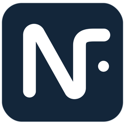

<p align="center">
  
</p>

<h1 align="center">NetraFlow</h1>

<p align="center">
  A local asset change tracking application
</p>

<p align="center">
  <a href="README.md">简体中文</a> · <strong>English</strong>
</p>

## Overview

NetraFlow (净流) is a local asset change tracking desktop application, primarily for Windows. It helps users record account balances, asset changes, and historical movement over time. It is designed for people who want to keep asset data on their own machine, maintain it manually, and review changes by date.

The application is built with Electron, React, TypeScript, and Vite, with npm used for dependency management, development, testing, and packaging.

## Features

- Manage asset and liability account types, plus the accounts under each type.
- Record account creation, balance edits, deletion, archiving, reactivation, and other history.
- Review home asset stats, asset allocation, asset trends, and account-level charts.
- Use single-account quick entry and Flash Note to fill balances or net-worth changes across multiple dates.
- Import externally summarized JSON after local account matching and risk review.
- Search accounts, history records, snapshot records, and settings with global search.
- Export and import manual snapshots, configure automatic snapshots, and encrypt new snapshots with the login password that was active when the snapshot was created.
- Configure theme, charts, search, data backup, and security-related settings.

## Download and Installation

Regular users should download published builds from [GitHub Releases](https://github.com/umucatt/NetraFlow/releases).

Windows builds provide two artifact types:

- Setup: `NetraFlow_<version>_Setup.exe`, for installation through an installer wizard.
- Portable: `NetraFlow_<version>_Portable.zip`, unzip it and run `NetraFlow.exe`.

The Setup uninstaller checks local user-data deletion by default. If the user clears that option, `userdata/` is kept under the original installation directory, and reinstalling to the same directory continues to read the retained data. Portable data also lives under the extracted directory, so deleting the whole extracted directory deletes the data unless it has been backed up first.

Current Windows builds are not code signed. Windows or security software may show a source warning on first launch, so verify that the file came from this repository's Releases page before continuing.

## Basic Usage

1. Create asset or liability account types, then add accounts under those types.
2. Enter balances and changes through account actions, single-account quick entry, or Flash Note.
3. Review changes from the home page, asset overview, account details, and history.
4. Use charts to inspect asset allocation, asset trends, and account trends.
5. Export snapshots before larger edits or imports, and restore from a snapshot when needed.
6. When using summary import, review the JSON format, account matching results, and import risks before writing data locally.

## Data and Privacy

NetraFlow stores current data locally. It does not provide cloud sync and does not automatically upload asset data. Users can back up data through manual snapshots and automatic snapshots.

In 0.9.9, current local data still uses four formal JSON files: `core.json` stores account types, accounts, and history records, and is encrypted with the login password after login password protection is enabled; `settings.json` stores automatic snapshot, chart, and normal global preferences; `state.json` stores snapshot records, import records, first-welcome state, and theme-unlock runtime state; `security.json` stores only reconstructable behavior settings such as auto-lock timing and forced snapshot encryption. `security.json` does not store login passwords, password hashes, snapshot passwords, keys, or any parameter required to decrypt existing files.

Both Setup and Portable builds store user data in `userdata/` under the application directory by default. Runtime caches, logs, and Electron profile data are stored in `runtime/` under the application directory. The development runtime and userdata are isolated from the production application, so development data does not pollute normal user data.

0.9.9 does not automatically migrate old development `storage.json` data and no longer uses a `previous` recovery path. After login password protection is enabled, the login password is the decryption password for local `core.json`; NF does not store the login password or reusable decryption credentials on disk. While unlocked, only a session key is retained in main-process memory, and it is discarded after locking or exit. NetraFlow does not limit retry attempts and cannot recover encrypted local core data if the password is forgotten. New encrypted snapshots use the login password active at creation time. Changing or disabling the login password does not rewrite historical snapshots, so importing an older encrypted snapshot still requires the password used when that snapshot was created. Deleting or corrupting `security.json` does not affect the decryption parameters of existing encrypted core or snapshot files because those parameters are carried by the files themselves. NetraFlow 0.9.9 uses PBKDF2-HMAC-SHA-256 with 600,000 iterations. This parameter was finalized from extreme-data measurements with 48,000 history records plus conservative projection up to a 5x slower overall performance gap. This does not represent complete compatibility certification across all Windows hardware. Integrity mismatches are risk warnings, and user-initiated plaintext exports are not protected by the login password.

Example mode uses a temporary `.demo` directory next to the executable and cleans it on example exit or next startup. Example-mode operations do not write real `userdata/` and do not create real external snapshots; snapshot import/export and user-settings import/export are blocked while example mode is active.

## Current Limitations

- The application is primarily built for Windows; macOS and Linux are not current release targets.
- Windows builds are not code signed, so the system may display security warnings.
- Automatic updates are not provided. Users need to download new versions from Releases manually.
- Asset data is mainly entered manually or imported from local files. Automatic bank, brokerage, or market account sync is not provided.
- Local current data is not the same as a cloud backup. Export snapshots regularly and keep them somewhere safe.
- The Setup uninstaller checks local user-data deletion by default. If the user clears that option, user data is kept according to the installer's existing behavior.

## Development

### Requirements

- Node.js 22 LTS
- npm
- A Windows environment for validating the Windows desktop app and building Windows artifacts

### Get the Source

```bash
git clone https://github.com/umucatt/NetraFlow.git
cd NetraFlow
```

### Install Dependencies

```bash
npm ci
```

### Start the Development Environment

```bash
npm run dev
```

This command starts the Vite renderer development server, then launches Electron after the server is ready. Development runs with a separate application identity, runtime, and userdata.

### Type Checking

```bash
npm run typecheck
```

### Run Tests

```bash
npm test
```

### Production Build

```bash
npm run build
```

This command runs TypeScript checks, builds with Vite, and generates build outputs for the Electron main process and preload script.

### Local Release Check

```bash
npm run release:check
```

Use the strict release check before publishing:

```bash
npm run release:check -- --strict
```

Non-strict mode reports a dirty worktree as a warning. Strict mode treats a dirty worktree as an error.

### Windows Artifacts

Run the production build first:

```bash
npm run build
```

Then build the artifacts as needed:

```bash
npm run dist:installer
npm run dist:portable
```

Default artifact names are:

- `release/installer/<version>/NetraFlow_<version>_Setup.exe`
- `release/portable/<version>/NetraFlow_<version>_Portable.zip`

If an output directory for the same version already exists, the release scripts append a numeric suffix to the directory name.

### Versioning Rules

- Versions in `package.json` and `package-lock.json` must stay in sync.
- Release versions use `major.minor.patch` and may include a suffix.
- Release tags use `v<version>` and must point to the release commit.
- When the version is lower than `1.0.0`, or the suffix contains `beta` / `rc`, the Release is marked as a Pre-release.

### Automated Workflows

- A normal push to `main`, a pull request targeting `main`, or a manual dispatch runs Verify Windows.
- Verify Windows uses Node.js 22 and runs `npm ci`, `npm run typecheck`, `npm test`, and `npm run build` in order.
- Version tags matching `v*.*.*` or `v*.*.*-*` trigger Release Windows.
- Release Windows validates the tag and version, runs `npm run release:check -- --strict`, type checks, tests, builds, creates Setup and Portable artifacts, and verifies release files.
- GitHub Releases are created as Draft by default.
- Versions lower than `1.0.0`, or version suffixes containing `beta` / `rc`, are created as Pre-release.

## Project Structure

| Path | Description |
| --- | --- |
| `electron/` | Electron main process, preload script, local storage, and window-related logic |
| `src/` | React renderer, pages, feature modules, styles, and tests |
| `public/icons/` | Application icon source files; Windows packaging continues to use `netraflow.ico` |
| `docs/assets/` | Assets used by README and documentation |
| `scripts/` | Development startup, release checks, packaging, artifact verification, and release-note scripts |
| `build/` | Installer script resources and license files bundled with releases |
| `.github/workflows/` | Windows verification and release workflows |

## Extension Development Notes

- Changes to the local data structure need to preserve the four-file boundary, schema versioning, future-schema refusal, and the no-`previous` recovery path.
- Do not package development runtime, userdata, caches, logs, or user data into release artifacts.
- The Windows application icon source remains `public/icons/netraflow.ico`; `docs/assets/netraflow-icon.png` is only for README and documentation display.
- Release-flow changes should update `scripts/`, `.github/workflows/`, related tests, and README documentation together.
- Import, snapshot, and security-related features should continue to prioritize format validation, integrity checks, and recoverability tests.

## License

NetraFlow is licensed under GPL-3.0-only. See [LICENSE](LICENSE) for details.
